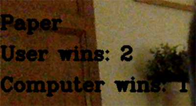

# Computer Vision RPS

Rock-Paper-Scissors is a game in which each player simultaneously shows one of three hand signals representing rock, paper, or scissors. Rock beats scissors. Scissors beats paper. Paper beats rock. The player who shows the first option that beats the other player's option wins. This is an implementation of an interactive Rock-Paper-Scissors game, in which the user can play with the computer using the camera.

## Milestone 1

- Set up of the dev environment.

## Milestone 2

- Using Teachable Machine an image project model has been created with four difference classes: Rock, Paper, Scissors & Nothing.
- The model will detect which hand signal the user has shown.

## Milestone 3

- A conda environment has been created and the necessary requirements installed.
- A requirements.txt file has been added, which will enable another user to easily install the exact dependencies if required.

## Milestone 4

- A script has been created that simulates a game of Rock Paper Scissors.
- The 'get_computer_choice' function randomly picks an option of either 'Rock', 'Paper' or 'Scissors', which will be the computers choice.

```python
def get_computer_choice():
    options = ['Rock', 'Paper', 'Scissors']
    computer = random.choice(options)
    print(f'The computer chooses {computer}.')
    return computer
```

- The 'get_user_choice' function asks the user to input their option. A while loop ensures only a valid option is input.

```python
def get_user_choice():
    while True:
        user = input('Enter Rock, Paper or Scissors')
        if user not in ['Rock', 'Paper', 'Scissors']:
            print('You must enter either Rock, Paper or Scissors exactly.')
        else:
            print(f'The user chooses {user}.')
            return user
```

- Using if-elif-else statements, the script determines a winner based on the classic rules of Rock Paper Scissors.

```python
def get_winner(computer_choice, user_choice):
    if computer_choice == user_choice:
        print('It is a tie!')
    elif user_choice == 'Rock':
        if computer_choice == 'Paper':
            print('You lost')
        else:
            print('You won!')
    elif user_choice == 'Paper':
        if computer_choice == 'Scissors':
            print('You lost')
        else:
            print('You won!')
    elif user_choice == 'Scissors':
        if computer_choice == 'Rock':
            print('You lost')
        else:
            print('You won!')
```

- A 'play' function calls the previous functions to run the game & prints whether the user has won or lost.

```python
def play():
    computer_choice = get_computer_choice()
    user_choice = get_user_choice()
    get_winner(computer_choice, user_choice)

play()
```

## Milestone 5

- New script created called 'camera_rps.py' which uses the output of the computer vision model to play Rock, Paper, Scissors.
- A 'countdown' function gives the user 5 seconds to show their hand. A message is displayed on screen during the countdown to give instruction.

```python
def countdown(self):
        cap = cv2.VideoCapture(0)
        start_time = time.time()
        while time.time() < start_time + self.countdown_time:
            ret, frame = cap.read()         
            cv2.putText(frame, "Please choose between Rock, Paper or Scissors.", (50, 100), cv2.FONT_HERSHEY_COMPLEX, 1, (0, 0, 0), 3)
            cv2.imshow("frame", frame)
            if cv2.waitKey(1) & 0xFF == ord('q'):
                break
```

- A while loop within the 'play_game' function ensures the game will be repeated until either the user or computer wins three rounds.

```python
def play_game(model):
    game = RockPaperScissors(model)
    game.countdown()
    while True:
        if game.computer_wins == 3:
            print('You lost! The computer won 3 times.')
            restart = input('Press R to restart the game. Press Q to quit.')
            if restart.lower() == "r":
                game.computer_wins = 0
                game.user_wins = 0
                game.get_computer_choice()
                game.get_prediction()
            else:
                break
        elif game.user_wins == 3:
            print('You won! You beat the computer 3 times.')
            restart = input('Press R to restart the game. Press Q to quit.')
            if restart.lower() == "r":
                game.computer_wins = 0
                game.user_wins = 0
                game.get_computer_choice()
                game.get_prediction()
            else:
                break
        else:
            game.get_computer_choice()
            game.get_prediction()
```

- To improve the user experience, text is displayed with the users current hand selection & the current wins for the user/computer whilst the game is being played.




